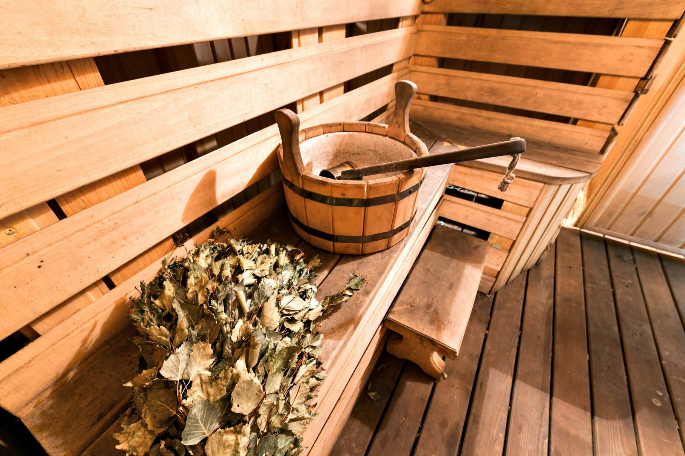
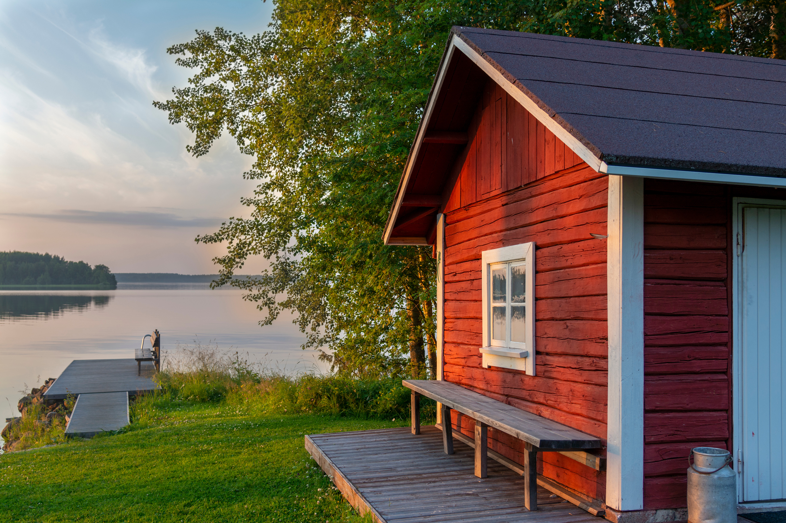

# What is Heritage Management?

## Background

Heritage management aims to explore how the concept of heritage is an active process, where people give things meaning. As Laurajane Smith writes, “heritage is heritage because it is subjected to the management and preservation/conservation process, not because it simply ‘is’” (2006: 3). This places people at the forefront of heritage management, as they decide what is worth conserving as “heritage”.

While tangible forms of heritage, such as buildings, monuments or objects, can be preserved in situ or in museums, intangible heritage is more commonly conserved by people from one generation to another. Older generations can teach younger generations about these practices, ensuring that they understand and respect their significance.

Heritage management can take place on a larger or smaller scale. There are so-called ‘World Heritage Sites’, controlled by UNESCO. Each state aims to ensure “the identification, protection, conservation, presentation and transmission to future generations of the cultural and natural heritage” (UNESCO 1972: 3) present within their region and community.

Below is an image of what could be considered "World Heritage".

# Different Types of Heritage

## Physical or “Tangible” Heritage

These types of sites may be more recognisable as heritage to most people, as there is something physically and visually impressive that should be protected (Davallon 2024). Heritage management as a field has traditionally preferred a materials-based approach, where monuments, buildings and other physical objects from the past are preserved from further ruin. This approach is largely based on the Venice Charter (ICOMOS 1964), which highlights the responsibility of each nation to safeguard the preservation of their ancient monuments for future generations.

Over time, the discipline has shifted towards a more values-based approach to heritage management, a move that was heavily influenced by the Burra Charter, first adopted in 1979 (Australia ICOMOS 2013). The primary goal of this approach is to protect and maintain the significance of heritage objects and sites in the interest of various groups or communities (de la Torre 2013). Although attributing value continues to be a major component of heritage management today, some scholars critique its dominance within the sphere. For instance, Poulios (2010) argues that value is no longer an adequate focus when addressing living heritage, as there is a strong discontinuity between the monuments of the past and the people of the present. He claims that living heritage approaches more directly address the associations different communities have with sites by focusing on the continuity of the past into the future through the present.

## Intangible Cultural Heritage

In addition to physical structures, there are also other forms of heritage that are intangible, which are equally worth conserving or preserving. UNESCO (2024: 5) defines intangible cultural heritage as “the practices, representations, expressions, knowledge, skills – as well as the instruments, objects, artefacts and cultural spaces associated therewith – that communities, groups and, in some cases, individuals recognize as part of their cultural heritage.” This heritage is passed down within communities from generation to generation through constant recreation and interaction with their environment and history, ultimately providing members of the community with a sense of identity (Blake 2019).

For instance, the importance of sauna culture in Finland may be difficult to explain to a foreigner. Yet it takes up a central place within Finnish cultural heritage, both as a historical tradition and as a part of everyday life (Talasniemi 2025). While saunas do exist in other countries, they do not hold the same cultural significance everywhere that they do in Finland. There are certain practices and traditions connected to the sauna that Finnish people learn as they grow up, which non-Finns may not know about. While the sauna is a physical place, the culture surrounding it is what makes it a form of intangible heritage (Lamminmäki and Seesmeri 2025). This is why it was inscribed on the Representative List of the Intangible Cultural Heritage of Humanity (UNESCO 2020).

