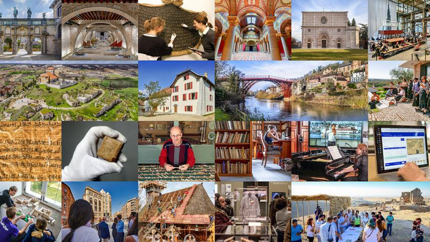

# Digital Technologies in Heritage Management

## How Digital Technologies are Used in Heritage Management

Intangible heritage can be more difficult to conserve or manage compared to tangible heritage materials, as the significance of these practices may only be understood by a certain community. Due to the impact of globalisation and urbanisation, traditional processes have become increasingly internationalised and local knowledge of these practices has decreased significantly (Mazel et al. 2017). One increasingly popular way of protecting intangible cultural heritage is through digital means (Underberg-Goode 2017). The digitisation of heritage has also been safeguarded in the UNESCO Charter on the Preservation of Digital Heritage (UNESCO 2003), marking its importance within the heritage management sphere.

Since the early twenty-first century, the connection between digital technologies and heritage has become increasingly apparent due to the growing prevalence of digital tools in cultural preservation practices. This evolving digital landscape opens up new opportunities for collaboration, interaction and representation of heritage among communities and researchers. With this shift towards more engaging and inclusive approaches, digital heritage platforms have become vital tools for the co-production of knowledge. In addition to easing the digitisation of heritage, these platforms also raise more awareness about non-heritagised sites through the active participation of users, allowing for a broader, more balanced engagement with cultural heritage narratives (Stiti 2025).

Digital technologies can be particularly useful in communicating heritage to the general public. In museum contexts, digital technologies allow for more interactive exhibition spaces, which can enrich museum collections and consequently engage the public more directly (Giovannini, Lo Turco and Tomalini 2021). For example, in Italy, the Museum of the Passione di Sordevolo used digital technologies, such as video storytelling and 3D modelling, to recreate the scenography of a popular theatrical experience in Sordevolo (Giovannini, Lo Turco and Tomalini 2021). This made it easier for the community and visitors to experience a time they could not otherwise access but could still recognise through historical pictures.

## Arches Project

Another way in which digital technologies can benefit heritage management practices is by facilitating services that can be shared around the world. As heritage is actively being created in all parts of the world, there is always something new to discover. If a heritage item is in a different country, the only way to access it may be through digital means. Therefore, digital services that can be accessed from multiple locations can be useful for heritage practitioners.

One such example is the Arches Project. Arches is an open-source, geospatial information and data management platform that can be adapted to address various cultural heritage needs. Arches was created specifically for the international cultural heritage field, and designed to be adaptable to different contexts. Due to its open-source foundation, the platform can connect users from different regions with different goals, allowing for cooperation and comparison (Arches Project 2025).

Arches is used by various organisations to document and manage their data on heritage resources for various purposes. For instance, the Arches platform may be used to create heritage inventories that gather information on cultural heritage resources, to manage heritage science data from an analytical perspective, to support research on digital humanities approaches, and to facilitate the project management process for infrastructure and construction projects (Arches Project 2025).

## Application Programming Interfaces (APIs) in Heritage Management

Heritage management practitioners can also make use of APIs in their work. One such example is the Europeana API network (Europeana 2024). The Europeana APIs allow users to access the various digitised collections in Europeana’s network of cultural heritage institutions across Europe. The three main formats of these APIs are the Search API, the Record API and the IIIF APIs. The Search API allows users to search for the metadata records of cultural heritage items and media in Europeana’s collections (Wuyts 2025). The Record API allows users to directly access Europeana’s data and metadata stored in the Europeana Data Model (Wuyts 2024b). The IIIF APIs present visualisations of digital objects composed of images, sound, video and potentially 3D media (Wuyts 2024a).

These APIs can be useful for heritage practitioners, as they allow the user to have access to a vast range of heritage item collections. This opens up several potential avenues of work. For example, a heritage practitioner can gather information on a specific time period in a specific country. By accessing the Europeana APIs, they are able to search for and examine the information in a digital, easily accessible format. Often, there are full recreations of heritage objects or heritage sites in these collections, which can be examined in detail without having to travel to a different country.

Below is an image with examples of cultural heritage around Europe.

